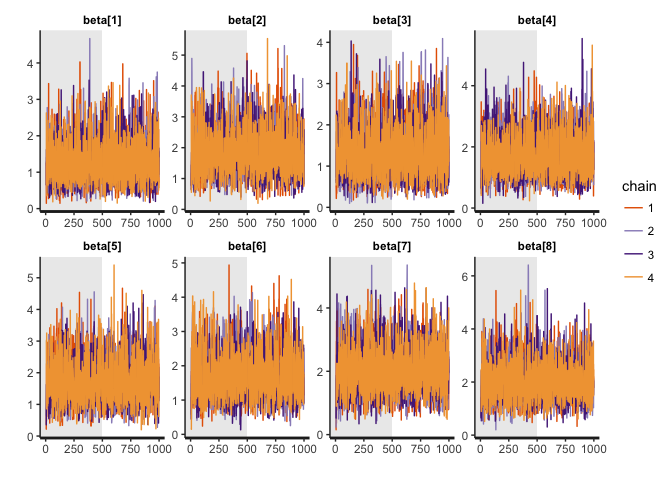
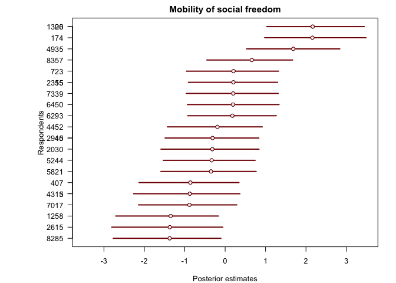
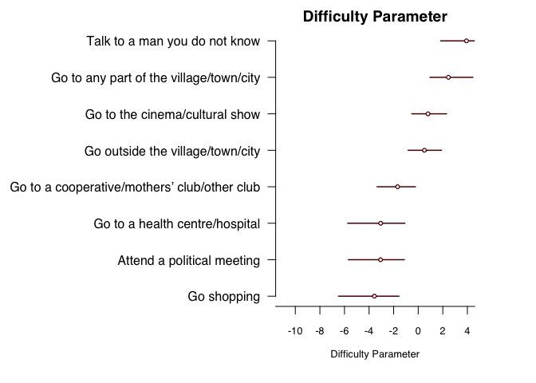
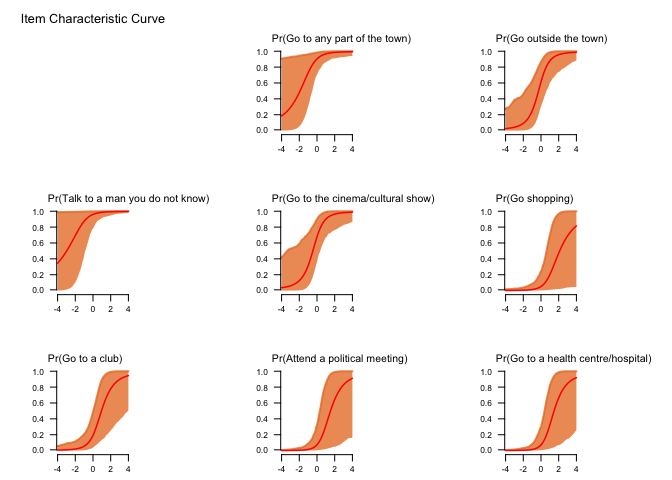

Item-Response Theory model with RStan
================
Zhanna Terechshenko
May 10, 2017

Introduction
------------

This vignette is designed to give an introduction of how to estimate Item-Response Theory (IRT) model in R using the RStan package. IRT model is a type of latent variable model, which is used to generate estimates of a latent trait of interest by combining information from observable items or manifest variables. This vignette assumes that the user has a prior knowledge about IRT models and focuses on the use of Stan, C++ program, which performs Bayesian inference or optimization for arbitrary user-specified models using a No-U-Turn sampler (Hoffman and Gelman [2014](#ref-hoffman2014no)), an adaptive form of Hamiltonian Monte Carlo sampling (Neal and others [2011](#ref-neal2011mcmc)). Stan has interfaces for the command-line shell (CmdStan), Python (PyStan), R (RStan), MATLAB (MatlabStan), Julia (Stan.jl), Stata (StataStan), and Mathematica (MathematicaStan) and it runs on Windows, Mac OS X, and Linux. Stan is open-source and is available at <http://mc-stan.org/> along with instructions, 500-page user manual and tutorials. In this vignette, I'll show how to estimate very simple binary response two-parameter logistic model using RStan.

Getting Started
---------------

### Installation

Stan requires a C++ compiler, such as [g++](https://gcc.gnu.org/) or [clang++](http://clang.llvm.org/).

The rstan package also depends on following R packages:

-   StanHeaders (Stan C++ headers)
-   BH (Boost C++ headers)
-   RcppEigen (Eigen C++ headers)
-   Rcpp (facilitates using C++ from R)
-   inline (compiles C++ for use with R)

For instructions on installing RStan see [RStan-Getting-Started](https://github.com/stan-dev/rstan/wiki/RStan-Getting-Started#prerequisites).

### Loading the package

``` r
library(rstan) # load rstan library
rstan_options(auto_write = TRUE) # save a bare version of a compiled Stan program to the hard disk so that it does not need to be recompiled
options(mc.cores = parallel::detectCores()) # execute multiple Markov chains in parallel
```

Model
-----

### Preparing data

For this vignette, I’ll be using data from Bangladesh Fertility Survey of 1989 (Huq and Cleland [1990](#ref-huq1990bangladesh)). The latent trait of interest is women’s mobility of social freedom. Women were asked whether they could engage in the following activities alone (1 = yes, 0 = no):

-   **Item 1** Go to any part of the village/town/city.

-   **Item 2** Go outside the village/town/city.

-   **Item 3** Talk to a man you do not know.

-   **Item 4** Go to a cinema/cultural show.

-   **Item 5** Go shopping.

-   **Item 6** Go to a cooperative/mothers’ club/other club.

-   **Item 7** Attend a political meeting.

-   **Item 8** Go to a health centre/hospital.

``` r
set.seed(927)
library(ltm) # package Mobility dataset is taken from
response <- Mobility[sample(1:nrow(Mobility), 20,
                          replace=FALSE),]# Running an IRT model in Stan can be expensive time-wise.
#For the purpose of this vignette, I limit my sample to 20 observations chosen randomly from the dataset
```

Number of rows in the data correspond to the number of observations (subjects, countries, etc) while columns indicate items or manifestations of latent trait:

``` r
 # Sample from the dataset
head(response)
```

    ##      Item 1 Item 2 Item 3 Item 4 Item 5 Item 6 Item 7 Item 8
    ## 4313      1      0      1      0      0      0      0      0
    ## 5821      1      0      1      1      0      0      0      0
    ## 174       1      1      1      1      1      1      1      1
    ## 7339      1      1      1      1      0      0      0      0
    ## 1306      1      1      1      1      1      1      1      1
    ## 7017      1      0      1      0      0      0      0      0

The stan function accepts data as a named list, a character vector of object names, or an environment (“RStan: The R Interface to Stan” [2017](#ref-STAN)).

``` r
n <- nrow(response) # number of observations
k <- 8              # number of items (manifestations)

stan.data <- list(n=n,
k=k,
y1=response$'Item 1',
y2=response$'Item 2',
y3=response$'Item 3',
y4=response$'Item 4',
y5=response$'Item 5',
y6=response$'Item 6',
y7=response$'Item 7',
y8=response$'Item 8'
)
```

### Model specification

The two-parameter IRT model can be written as:


where <a href="https://www.codecogs.com/eqnedit.php?latex=y_{ij}" target="_blank"></a> is the response for person *j* to item *i*, *α*<sub>*i*</sub> and *β*<sub>*i*</sub> are difficulty and discrimination parameters, and *θ*<sub>*j*</sub> is the latent trait of interest. Difficulty parameter *α*<sub>*i*</sub> shows the proportion of observations in each category of the latent trait is equal to zero. Discrimination parameter *β*<sub>*i*</sub> indicates the extent to which a change in the value of one of the items corresponds to a change in the latent trait (Jackman [2009](#ref-jackman2009bayesian)).

*θ*<sub>*j*</sub> is specified as a draw from the standard normal distribution such that *θ*<sub>*j*</sub> ∼ *N*(0,1).

Priors for the parameters are chosen as following: *α* ∼ *N*(0, 4) and *β* ∼ *Γ*(4, 3)

The first section of the Stan program, the data block, specifies the data that is conditioned upon in Bayes Rule. For example, in this context, these are number of subjects, number of items, and the vectors of estimates. Data are declared as integer or real and can be vectors or arrays. Data can also be constrained.

The parameters block declares the parameters whose posterior distribution is sought. In case of two-parameter IRT models, the parameters of interest usually are difficulty (*α*) and discrimination (*β*) parameters and latent variable (*θ* or *X*).

Finally, in the model block, we declare priors for the parameters and define the function.

``` r
model <- "
data {
    int<lower=0> n; // number of subjects
    int<lower=0> k; // number of items
    int<lower=0, upper=1> y1[n]; // manifestation variables
    int<lower=0, upper=1> y2[n];
    int<lower=0, upper=1> y3[n];
    int<lower=0, upper=1> y4[n];
    int<lower=0, upper=1> y5[n];
    int<lower=0, upper=1> y6[n];
    int<lower=0, upper=1> y7[n];
    int<lower=0, upper=1> y8[n];

}
parameters {
    vector[k] alpha;
    real<lower=0> beta[k];
    vector[n] x;    // this is theta but its easier to see as x in the code
}

model {
    // priors
    x ~ normal(0,1); 
    alpha ~ normal(0,4); 
    beta ~ gamma(4,3); 
    
    // items
y1 ~ bernoulli_logit(alpha[1] + beta[1] * x);
y2 ~ bernoulli_logit(alpha[2] + beta[2] * x);
y3 ~ bernoulli_logit(alpha[3] + beta[3] * x);
y4 ~ bernoulli_logit(alpha[4] + beta[4] * x);
y5 ~ bernoulli_logit(alpha[5] + beta[5] * x);
y6 ~ bernoulli_logit(alpha[6] + beta[6] * x);
y7 ~ bernoulli_logit(alpha[7] + beta[7] * x);
y8 ~ bernoulli_logit(alpha[8] + beta[8] * x);

}

"
# -------------------------------------------------- #
```

### Posterior sampling

To draw posterior samples we call stan function:

``` r
fit <- stan(model_code = model,
            data = stan.data, # named list of data
            iter = 1000, # total number of iterations per chain
            chains = 4, # number of Markov chains
            cores=2) # number of cores
```

The stan function wraps the following three steps:

-   Translate a model in Stan code to C++ code
-   Compile the C++ code to a dynamic shared object (DSO) and load the DSO
-   Sample given some user-specified data and other settings

The stan function returns a stanfit object, which is an S4 object of class "stanfit". One of the ways to assess the draws from the posterior distribution stored in the object is extract function:

``` r
output <- extract(fit, permuted = TRUE) 
```

Model Output
------------

### Analysis

Now can draw the traceplot to inspect the sampling behavior and assess mixing across chains and convergence:

``` r
traceplot(fit, pars = "beta", inc_warmup = T, nrow = 2)
```



In order to access convergence, we look primarily to the Rhat statistic, which provides the estimated ratio of the squared root of the variance of the mixture of all the chains to the average within-chain variance for a given parameter (Gelman and Hill [2006](#ref-gelman2006data)). At convergence, Rhat will equal one, but values less than 1.1 are considered acceptable for most applications. When Rhat is near one for all parameters, we judge the chains to have converged.

Print function allows us to view summaries of the parameter posteriors:

``` r
print(fit, pars=c("alpha", "beta", "x", "lp__"), probs=c(.5,.9))
```

    ## Inference for Stan model: 27f0b29aed271edbdcabdd5f0f27fb42.
    ## 4 chains, each with iter=1000; warmup=500; thin=1; 
    ## post-warmup draws per chain=500, total post-warmup draws=2000.
    ## 
    ##            mean se_mean   sd    50%    90% n_eff Rhat
    ## alpha[1]   2.46    0.02 0.87   2.38   3.58  2000    1
    ## alpha[2]   0.51    0.02 0.70   0.50   1.40  1734    1
    ## alpha[3]   3.93    0.03 1.28   3.79   5.66  2000    1
    ## alpha[4]   0.80    0.02 0.71   0.76   1.72  2000    1
    ## alpha[5]  -3.57    0.03 1.30  -3.40  -2.06  2000    1
    ## alpha[6]  -1.67    0.02 0.81  -1.61  -0.69  2000    1
    ## alpha[7]  -3.06    0.03 1.20  -2.91  -1.70  1637    1
    ## alpha[8]  -3.06    0.03 1.15  -2.94  -1.69  2000    1
    ## beta[1]    1.29    0.01 0.59   1.19   2.05  2000    1
    ## beta[2]    1.80    0.02 0.72   1.71   2.76  2000    1
    ## beta[3]    1.31    0.01 0.61   1.22   2.14  2000    1
    ## beta[4]    1.74    0.02 0.71   1.64   2.71  2000    1
    ## beta[5]    1.73    0.02 0.70   1.63   2.70  2000    1
    ## beta[6]    1.69    0.01 0.66   1.60   2.58  2000    1
    ## beta[7]    2.04    0.02 0.72   1.96   3.00  2000    1
    ## beta[8]    2.03    0.02 0.72   1.96   2.97  2000    1
    ## x[1]      -0.87    0.01 0.65  -0.86  -0.05  2000    1
    ## x[2]      -0.35    0.01 0.61  -0.32   0.43  2000    1
    ## x[3]       2.16    0.01 0.65   2.13   2.99  2000    1
    ## x[4]       0.20    0.01 0.57   0.18   0.94  2000    1
    ## x[5]       2.17    0.01 0.61   2.15   2.93  2000    1
    ## x[6]      -0.88    0.01 0.64  -0.87  -0.06  2000    1
    ## x[7]      -0.34    0.01 0.60  -0.32   0.41  2000    1
    ## x[8]      -0.19    0.01 0.62  -0.16   0.60  2000    1
    ## x[9]      -1.35    0.01 0.66  -1.33  -0.51  2000    1
    ## x[10]     -1.37    0.02 0.70  -1.35  -0.48  2000    1
    ## x[11]     -0.86    0.01 0.62  -0.85  -0.08  2000    1
    ## x[12]     -1.37    0.02 0.70  -1.35  -0.49  2000    1
    ## x[13]      0.19    0.01 0.57   0.20   0.89  2000    1
    ## x[14]      1.68    0.01 0.58   1.67   2.39  2000    1
    ## x[15]      0.18    0.01 0.56   0.19   0.88  2000    1
    ## x[16]     -0.32    0.01 0.61  -0.29   0.44  2000    1
    ## x[17]      0.21    0.01 0.57   0.22   0.91  2000    1
    ## x[18]      0.20    0.01 0.55   0.21   0.90  2000    1
    ## x[19]     -0.31    0.01 0.59  -0.31   0.45  2000    1
    ## x[20]      0.66    0.01 0.54   0.67   1.34  2000    1
    ## lp__     -87.97    0.16 4.44 -87.56 -82.52   779    1
    ## 
    ## Samples were drawn using NUTS(diag_e) at Wed May 10 14:37:22 2017.
    ## For each parameter, n_eff is a crude measure of effective sample size,
    ## and Rhat is the potential scale reduction factor on split chains (at 
    ## convergence, Rhat=1).

### Plots

In this section, I show how to plot posterior estimates, discrimination (alpha) and difficulty (beta) parameters, and item characteristics curves (ICC).

#### Posterior Estimates

``` r
INDEX <- 1:n # make an index and re-order it
INDEX <- INDEX[order(apply(output$x,2,mean))]

# take the means of the posterior distributions, based on the rank order of the means
POSTERIORS <- apply(output$x,2,mean)[INDEX]

# make a plot
par(mar=c(4,8,2,2), font=1, font.lab=1, cex=0.8)
plot(POSTERIORS, 1:n, xlim=c(-3.5,3.5),  xlab="Posterior estimates", main="Mobility of social freedom", ylab="Respondents", las=1)

# upper and lower bounds of the posterior distributions
lb <- apply(output$x,2,quantile,.025)[INDEX]
ub <- apply(output$x,2,quantile,.975)[INDEX]

# loop through each estimate and plot a line for the 95% credible interval
for(i in 1:n){
    lines(c(lb[i], ub[i]), c(i,i), col="#820303", lwd=2)
}

# place the points on top of the credible intervals
points(POSTERIORS, 1:n, col="#820303", bg="#f7f2f2", cex=1, pch=21)

# add an axis to the right side of the panel with the names of the subjects, based on rank order
axis(side=2, at=1:n, labels=as.character(rownames(response))[INDEX], las=1)
```



#### Difficulty and Discrimination Parameters

``` r
INDEX <- 1:k
INDEX  <- INDEX[order(apply(output$beta,2,mean))]
BETA <- apply(output$beta,2,mean)[INDEX]
LB.BETA <- apply(output$beta,2,quantile,.025)[INDEX]
UB.BETA <- apply(output$beta,2,quantile,.975)[INDEX]

par(
  family = "sans",
  oma = c(0,0,0,0),
  mar = c(5,18,2,4),
  mfrow= c(1,1)
)

plot(NULL,# create empty plot
     xlim = c(0,4), # set xlim by guessing
     ylim = c(1,8), # set ylim by the number of variables
     axes = F, xlab = NA, ylab = NA,
     main="Discrimination Parameter", cex=0.8)  # turn off axes and labels   


for (j in order(BETA)){
  lines(c(LB.BETA[j], UB.BETA[j]),c(j,j),col="#820303", lwd=1.5)
  points(c(BETA[j], BETA[j]),c(j,j),bg=c("#f7f2f2"), col="#820303",  cex=.65, pch=21 )
}


lab=seq(-2,8,by=1)
axis(1, at=lab, labels=lab,cex.axis=.8)

NAMES <-c("Go to any part of the village/town/city", 
                  "Go outside the village/town/city",
                  "Talk to a man you do not know",
                  "Go to the cinema/cultural show",
                  "Go shopping",
                  "Go to a cooperative/mothers’ club/other club",
                  "Attend a political meeting",
                  "Go to a health centre/hospital")
axis(side=2, at=1:8, labels=NAMES[INDEX], las=2, cex=0.8)
mtext(side = 1, "Discrimination Parameter",  line=2.5, cex=0.8)
```


``` r
INDEX <- 1:k
INDEX  <- INDEX[order(apply(output$alpha,2,mean))]
ALPHA<- apply(output$alpha,2,mean)[INDEX]
LB.ALPHA <- apply(output$alpha,2,quantile,.025)[INDEX]
UB.ALPHA <- apply(output$alpha,2,quantile,.975)[INDEX]

par(
  family = "sans",
  oma = c(0,0,0,0),
  mar = c(5,18,2,4),
  mfrow= c(1,1)
)

plot(NULL,# create empty plot
     xlim = c(-11,4), # set xlim by guessing
     ylim = c(1,8), # set ylim by the number of variables
     axes = F, xlab = NA, ylab = NA,
     main="Difficulty Parameter", cex=0.8)  # turn off axes and labels   


for (j in order(ALPHA)){
  lines(c(LB.ALPHA[j], UB.ALPHA[j]),c(j,j),col="#600202", lwd=1.5)
  points(c(ALPHA[j], ALPHA[j]),c(j,j),bg=c("#f7f2f2"), col="#600202",  cex=.65, pch=21 )
}


lab=seq(-12,12,by=2)
axis(1, at=lab, labels=lab,cex.axis=.8)

axis(side=2, at=1:8, labels=NAMES[INDEX], las=2, cex=0.8)
mtext(side = 1, "Difficulty Parameter", main='Difficulty', line=2.5, cex=0.8)
```



#### Item Characteristic Curves

``` r
PARAMETERS = cbind(apply(output$alpha,2,mean),apply(output$alpha,2,sd),apply(output$alpha, 2, quantile, 0.975 ),apply(output$alpha, 2, quantile, 0.025 ), apply(output$beta,2,mean),apply(output$beta,2,sd),apply(output$beta, 2, quantile, 0.975 ),apply(output$beta, 2, quantile, 0.025 ) )
colnames(PARAMETERS)<-c("a_mean","a_sd","a_975","a_025","b_mean","b_sd","b_975","b_025")


NAMES <-c("Pr(Go to any part of the town)", 
                  "Pr(Go outside the town)",
                  "Pr(Talk to a man you do not know)",
                  "Pr(Go to the cinema/cultural show)",
                  "Pr(Go shopping)",
                  "Pr(Go to a club)",
                  "Pr(Attend a political meeting)",
                  "Pr(Go to a health centre/hospital)")

par(mfrow=c(3,3), mar=c(2,3,2,6), xpd=NA)

SIM <- 1000

plot(NULL, xlim=c(0,1), ylim=c(0,1), type="n", yaxt="n", xaxt="n", yaxt="n", xlab="", ylab="", bty="n")
mtext("Item Characteristic Curve", cex=0.8)


for(j in 1:8){
  alpha <- rnorm(SIM, mean=PARAMETERS[j,1], sd=PARAMETERS[j,2])
  beta <- rnorm(SIM, mean=PARAMETERS[j,5], sd=PARAMETERS[j,6])
  x <- seq(from=-4, to=4, by=0.1)
  
  values <- 1 / (1+exp(-(alpha + beta %*% t(x))))
  
  plot(NULL, ylim=c(0,1.275), type="l", lwd=2, col=alpha("#E87722",.75), xaxt="n", yaxt="n", xlab="", ylab="", xlim=c(-5.75,5.75),bty="n")
  lines(x, apply(values,2,quantile, 0.975), ylim=c(0,1), type="l", lty=1, lwd=2, col=alpha("#E87722",.75))
  polygon(c(x,rev(x)),c(apply(values,2,quantile, 0.975), rev(apply(values,2,quantile, 0.025))),col=alpha("#E87722",.75), border=NA )
  text(-5.8,1.15,NAMES[j],  cex=1, pos=4)     
  axis(side=1, at=c(-4,-2,0,2,4),cex.axis=.8,mgp=c(3,.5,0))
  axis(side=2, at=c(0.01,.2,.4,.6,.8,1), labels=c("0.0","0.2","0.4","0.6","0.8","1.0"), tick=T, pos=-4.1, las=2, cex.axis=.8)    
  lines(x, apply(values,2,mean), ylim=c(0,1), type="l", lwd=1.5, col="red")
}
```



References
----------

Gelman, Andrew, and Jennifer Hill. 2006. *Data Analysis Using Regression and Multilevel/Hierarchical Models*. Cambridge university press.

Hoffman, Matthew D, and Andrew Gelman. 2014. “The No-U-Turn Sampler: Adaptively Setting Path Lengths in Hamiltonian Monte Carlo.” *Journal of Machine Learning Research* 15 (1): 1593–1623.

Huq, Md Najmul, and John Cleland. 1990. “Bangladesh Fertility Survey 1989 (Main Report).” \[Dhaka Bangladesh\]\[National Institute of Population Research; Training\]\[NIPORT\] 1990?

Jackman, Simon. 2009. *Bayesian Analysis for the Social Sciences*. Vol. 846. John Wiley & Sons.

Neal, Radford M, and others. 2011. “MCMC Using Hamiltonian Dynamics.” *Handbook of Markov Chain Monte Carlo* 2: 113–62.

“RStan: The R Interface to Stan.” 2017. <https://cran.r-project.org/web/packages/rstan/vignettes/rstan.html>.
